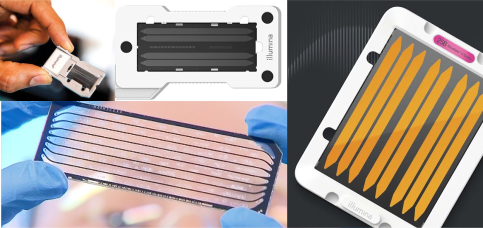
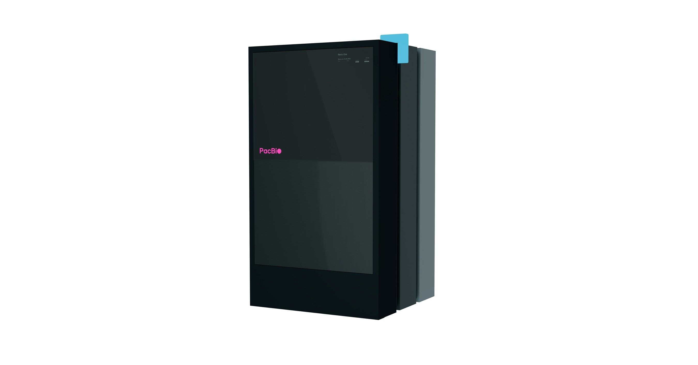
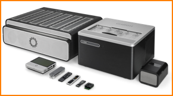

<!-- adding bold and italic options -->

## Sequencing Technologies

- What do we sequence?
- Genome assemblies and genome resequencing
- Illumina
- Pac Bio
- Oxford Nanopore

--- .segue .dark 

## What do we sequence?

---

## Your genome

---

## Molecular markers

Multiple methods exist for determining genotypes at genetic loci  

- Allozymes
- AFLPs
- RFLPs
- RAPDs
- Microsatellites
- SNPs

SNPs require **genotyping by sequencing** (GBS)

---

## SNPs (single nucleotide polymorphisms)

---

## Getting SNPs: RADseq

- RADseq: Restriction site associated DNA sequencing

--- &twocol

## Getting SNPs: SNP arrays

*** =left

- Target pre-determined SNP panels
- Thousands of loci
- Humans 
- Domesticated species

*** =right

---

## Getting SNPs: Whole genome sequencing

--- .segue .dark 

## Genome assemblies and resequencing

--- &twocol

## Genome assemblies

*** =left

- Sequence reads assembled into a **reference genome**
- *de novo* genome assembly
- Typically a single individual
- Typically uses long read technology
- Modern methods recover both haplotypes
- Requires **annotation**

Several quality metrics:
- Scaffold/chromosome level
- Scaffold N50
- BUSCO

*** =right

--- &twocol

## Genome resequencing

*** =left

- Sequencing reads mapped to an existing reference genome
- Easy to identify SNPs relative to reference, and to other samples
- Typically uses short read technology
- Much cheaper than *de novo* assembly
- Accuracy depends on the number of reads in the stack, termed **depth** or **coverage**
- Particularly heterozygous positions

*** =right

---

## Genome resequencing

--- .segue .dark 

## Illumina

---

## Illumina

---

## Data output

Platform | read pairs | Read length | data output | Genome coverage
---|---|---|---|---
MiniSeq|25 million|2 x 150 bp|7.5 Gb|2 x
MiSeq|25 million|2 x 300 bp|15 Gb|4 x
NextSeq 550|400 million|2 x 150 bp|120 Gb|33 x
NextSeq 2000|900 million|2 x 300 bp|540 Gb|150 x
HiSeq X|6 billion|2 x 150 bp|1.8 Tb|500 x
NovaSeq X Plus|52 billion|2 x 150 bp|16 Tb*|4444 x

- *16 Tb = 16,000,000,000,000 bp

---

## Sequencing by synthesis

1. Sample preparation
2. Bind DNA to flowcell, generate clusters
3. Sequencing by synthesis
4. Data analysis (in the machine)

---

## Sample preparation

*Indexes allow multiple samples to be sequenced at the same time

---

## Flow cell

--- bg:white

## Cluster generation

--- bg:white

## Sequencing by synthesis

--- bg:white

## Data analysis (in the machine)

---

## Illumina summary

- The current market leader
- Massive output
- High accuracy
- Many applications (genome resequencing, RADseq, transcriptomes, metabarcoding)
- Cheap (£8 per Gb)
- Major limitation is the read length

--- .segue .dark 

## PacBio

--- bg:white

## PacBio

--- bg:white

## Single Molecule, Real-Time (SMRT) sequencing

--- 

## HiFi reads

---

## PacBio summary

- Single molecule sequencing (no cluster generation)
- Long reads (around 25 kb)
- 75 Gb per SMRT Cell for Revio
- Fantastic for **genome assemblies**
- Historically high sequencing error, solved by HiFi sequencing
- Still more expensive than Illumina (~£3k per SMRT cell with library prep) 
- Price falling rapidly

--- .segue .dark 

## Oxford Nanopore

---

## Oxford Nanopore

--- bg:white

## How it works

---

## Field based sequencing

*Quick et al. 2016. Real-time, portable genome sequencing for Ebola surveillance. Nature*

---

## Oxford Nanopore summary

- Variable output, up to Tb's with larger platforms
- Long reads, record is 2.3 Mb!
- Output 20-30 Gb (up to 50 Gb) per Minion flow cell
- High error rate, currently 5-10 % but improving
- Still more expensive than Illumina and PacBio (~£750 for Minion flow cell and library prep)
- True portability and real time sequencing/analysis
- But need to buy sequencer: Minion £4,650 inc. 5 flow cells

---

## Recommended reading

<embed src="./assets/img/Illumina Inc - 2013 - Illumina Sequencing Technology - YouTube.pdf" width="100%" height="500" type="application/pdf" />

---

## Recommended reading

<embed src="./assets/img/Hu et al. - 2021 - Next-generation sequencing technologies An overview.pdf" width="100%" height="500" type="application/pdf" />

---

## Recommended reading

<embed src="./assets/img/Athanasopoulou et al. - 2022 - Third-Generation Sequencing The Spearhead towards the Radical Transformation of Modern Genomics.pdf" width="100%" height="500" type="application/pdf" />

--- &thankyou

## Next time:

**How to design a genomics project**
